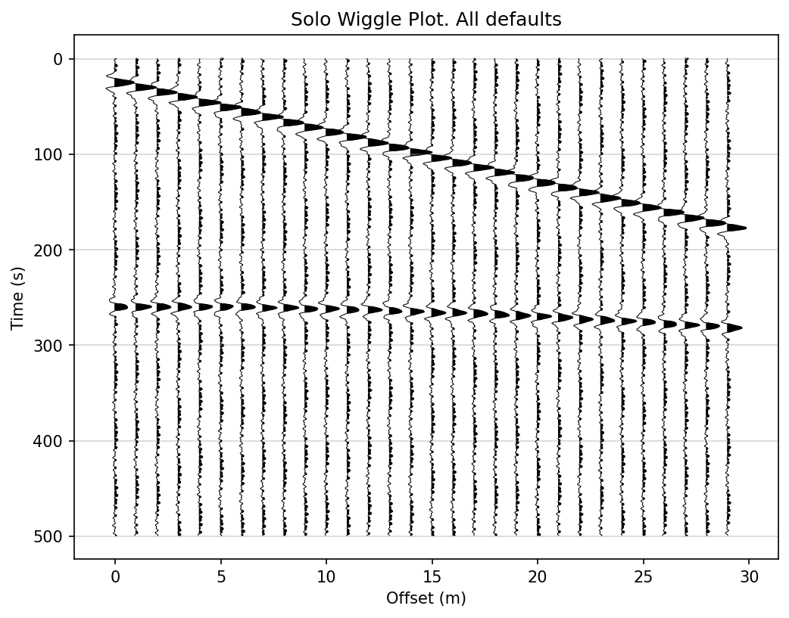
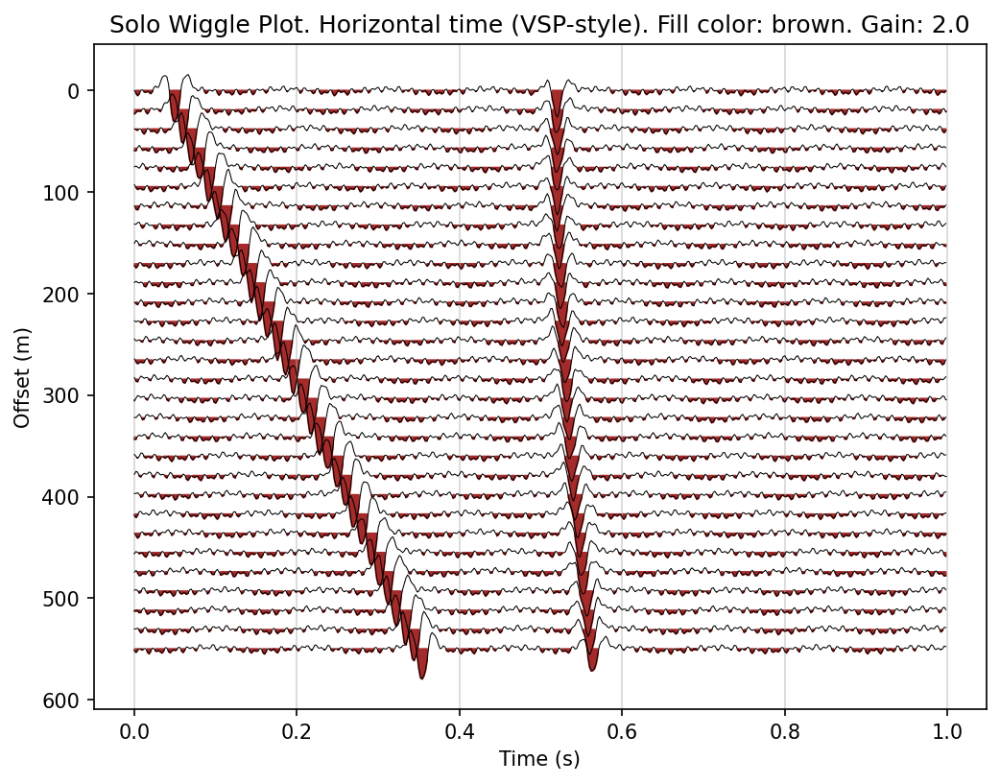
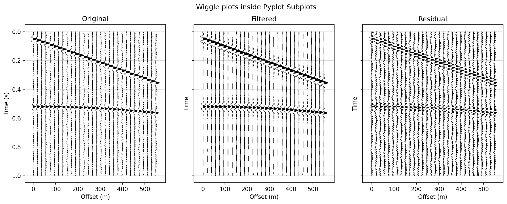

# SeisWiggle

Wiggle plot function for seismic data. Universal and pyplot-compatible.

## Installation

### Install from local directory

```bash
# Install in editable mode (recommended for development)
pip install -e .

# Or regular installation
pip install .
```

### Install dependencies separately

If you only need to install dependencies without installing the package:

```bash
pip install -r requirements.txt
```

## Usage

```python
from seiswiggle import wiggle_plot
import numpy as np
import matplotlib.pyplot as plt

# Your data of shape (n_traces, n_samples)
data = np.random.randn(30, 500)

# Option 1. Simple call
fig, ax = wiggle_plot(data)

# Option 2. Call with subplots
fig, axes = plt.subplots(1, 2, figsize=(10, 10))
wiggle_plot(data, axis=axes[0])
axes[0].set_title('Original data')
wiggle_plot(data_filtered, axis=axes[1])
axes[1].set_title('Filtered data')
```

## Parameters

- **data** (array-like, shape `(n_traces, n_samples)`): Seismic data array. Required.
- **time_values** (array-like, shape `(n_samples,)`, optional): Time samples. If `None`, uses `np.arange(n_samples)`. Default: `None`.
- **trace_values** (array-like, shape `(n_traces,)`, optional): Trace coordinates (e.g., offsets, CDP numbers). If `None`, uses `np.arange(n_traces)`. Default: `None`.
- **axis** (matplotlib.axes.Axes, optional): Matplotlib axis to plot on. If `None`, creates a new figure. Default: `None`.
- **gain** (float, optional): Gain factor for data normalization. Default: `1.0`.
- **vertical_time** (bool, optional): If `True`, time axis is vertical (standard seismic display). If `False`, time axis is horizontal (VSP-style). Default: `True`.
- **fill_color** (str or color, optional): Color for positive amplitude fill. Default: `'black'`.
- **fill_alpha** (float, optional): Transparency of the fill (0.0 to 1.0). Default: `1.0`.
- **line_color** (str or color, optional): Color of the wiggle lines. Default: `'black'`.
- **line_width** (float, optional): Width of the wiggle lines. Default: `0.5`.
- **clip** (float, optional): Clipping threshold for data normalization. Values are clipped to `[-clip * max_val, clip * max_val]`. If `None`, no clipping is applied. Default: `1.0`.
- **t_lim** (tuple, optional): Time axis limits `(t_min, t_max)`. Default: `None`.
- **x_lim** (tuple, optional): Trace axis limits `(x_min, x_max)`. Default: `None`.
- **figsize** (tuple, optional): Figure size `(width, height)` in inches. Only used when `axis=None`. Default: `(8, 6)`.
- **time_grid** (bool, optional): Enable grid lines along the time axis. Default: `True`.

## Returns

- If `axis=None`: Returns `(fig, axis)` tuple (matplotlib figure and axes).
- If `axis` is provided: Returns `axis` only.

## Examples

### Automatic wiggle plot with default parameters



### Horizontal time orientation (VSP-style)



### Usage example in a subplot grid



## Running Tests

```bash
python test.py
```

